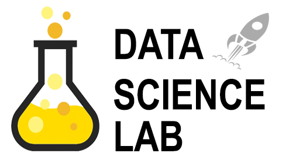

  

Repositório no qual apresento meus projetos e desafios ao longo da minha trajetória nessa parte de análise de dados e predições. A maioria destes projetos são desevolvidos em R ou Python dependendo da complexidade de implementação.

## Sobre:
Sou um Jovem no qual gosta de resolver problemas e trabalhar em equipe, buscando sempre as melhores soluções. Possuo experiência com pesquisas, desenvolvimento e análise de dados no RH (People Analytics). Minhas áreas de interesse são: aprendizado de máquina, algoritmos, big data e ciência de dados.

**Links:**

* [Linkedin](https://www.linkedin.com/in/vinicius-duzac-cerutti/)
* [Lattes](http://lattes.cnpq.br/8376795405312044)

## Projetos
* **Predição de Taxa de Desligamento para RH (People Analytics):** [repositório Github](https://github.com/viniCerutti/employee-turnover-analysis)
* **Deploy de Modelo de regressão logistica na web para predizer o destastre do titanic Kaggle:** [repositório Github](https://github.com/viniCerutti/Titanic-Web-ML)
